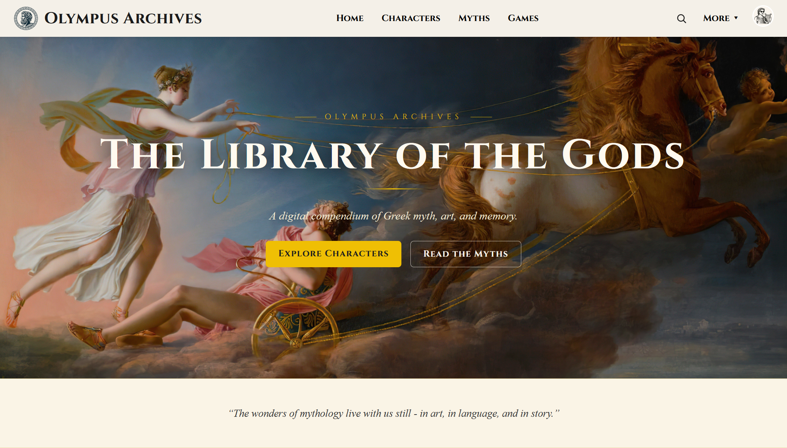
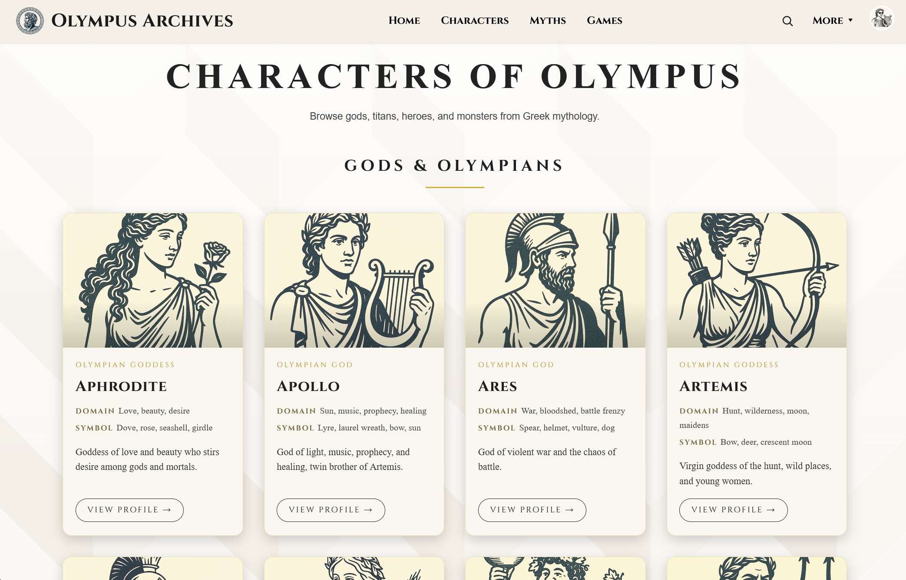
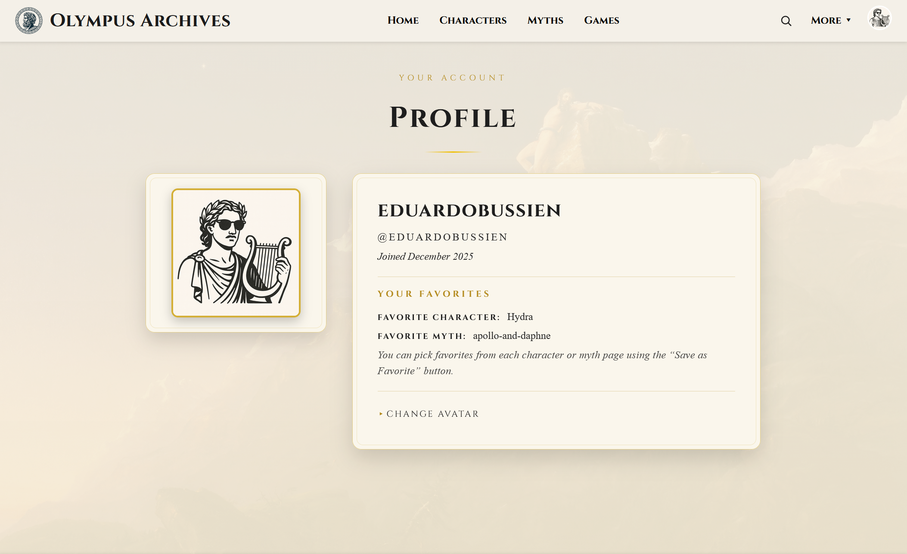
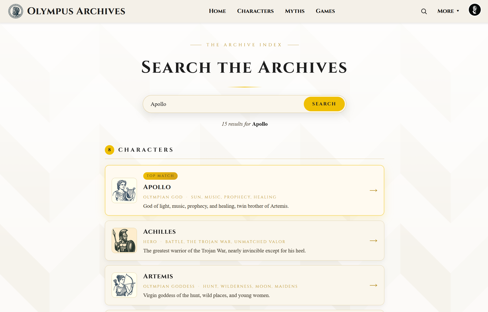
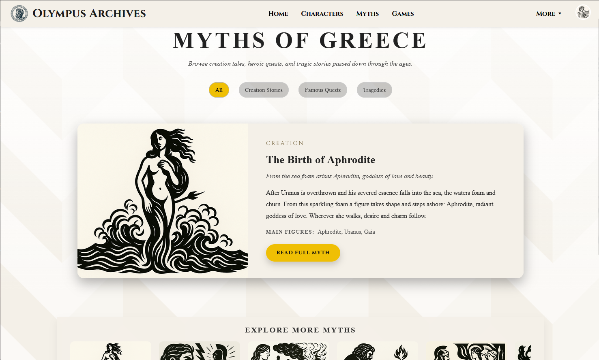

# Olympus Archives

A PHP + MySQL Greek mythology web application featuring a character database, myth archives, and dynamic JavaScript quizzes.

---

## Features

- Character database (Gods, Titans, Heroes, Monsters)
- Individual character profile pages
- Categorized myth archive
- "Which God Are You?" personality quiz
- Mythology trivia game
- User login and profile system
- SVG logo and responsive layout

---

## Tech Stack

- PHP (server-side rendering)
- MySQL (MariaDB via XAMPP)
- HTML5 + CSS3
- JavaScript (Dynamic Quiz Logic)
- SVG Graphics

---

## Screenshots

### Home Page

### Characters Page

### User Profile

### Search

### Myths

---

## Setup

1. Place project inside `xampp/htdocs/olympus`
2. Create database `olympus_db`
3. Run `sql/seed_characters.php`
4. Visit `http://localhost/olympus/html/index.php`
