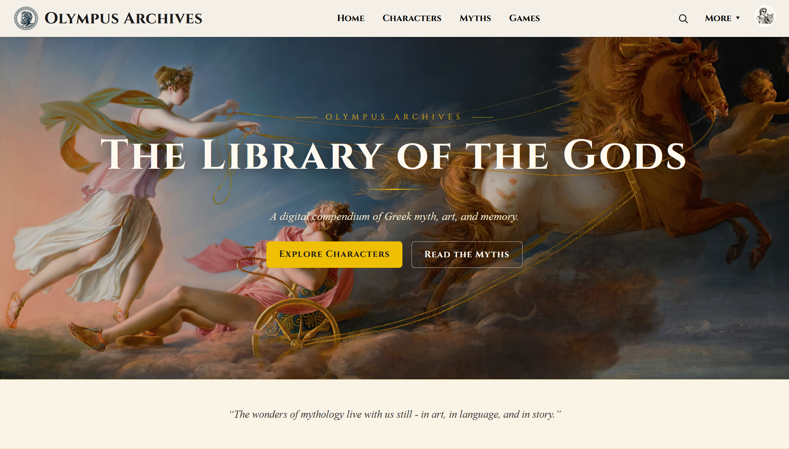
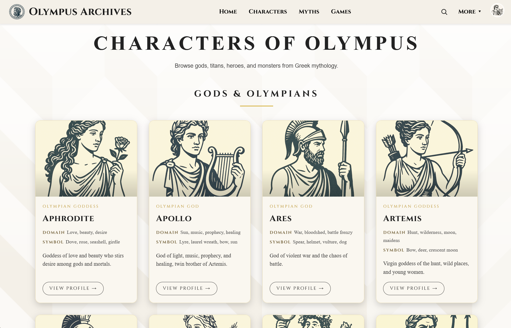
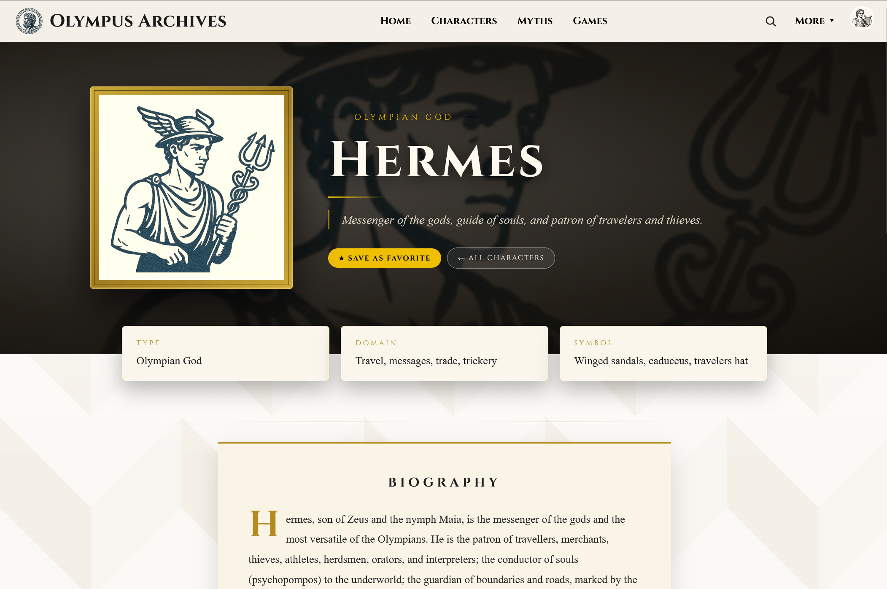
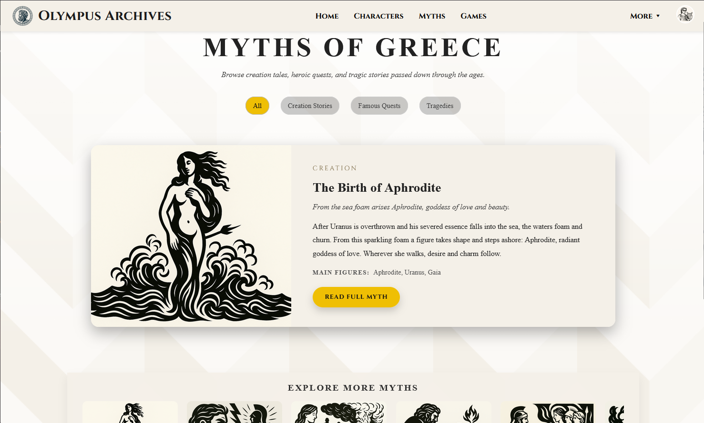
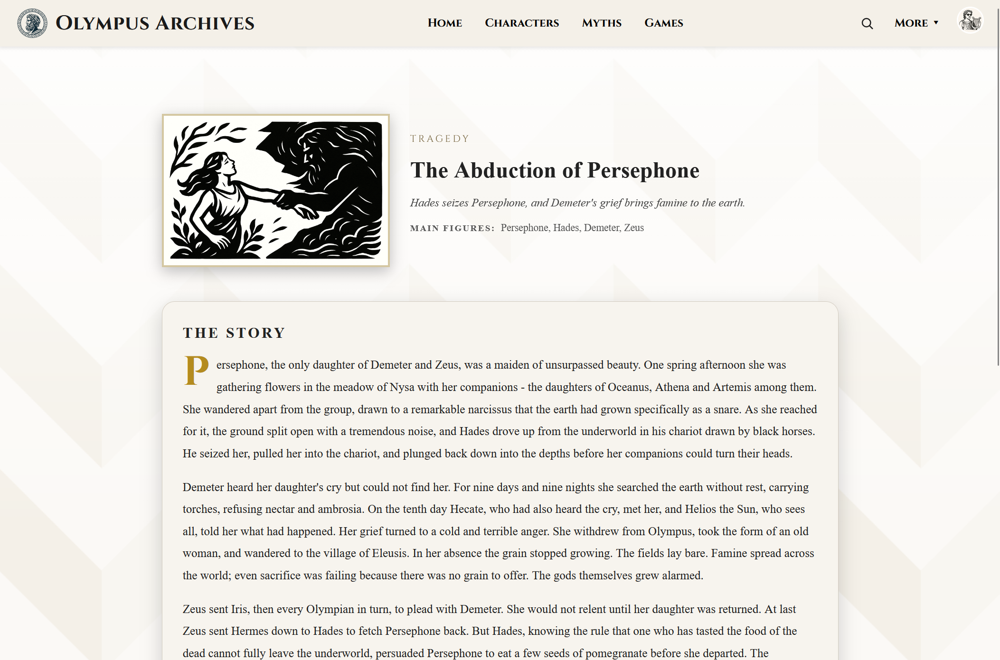
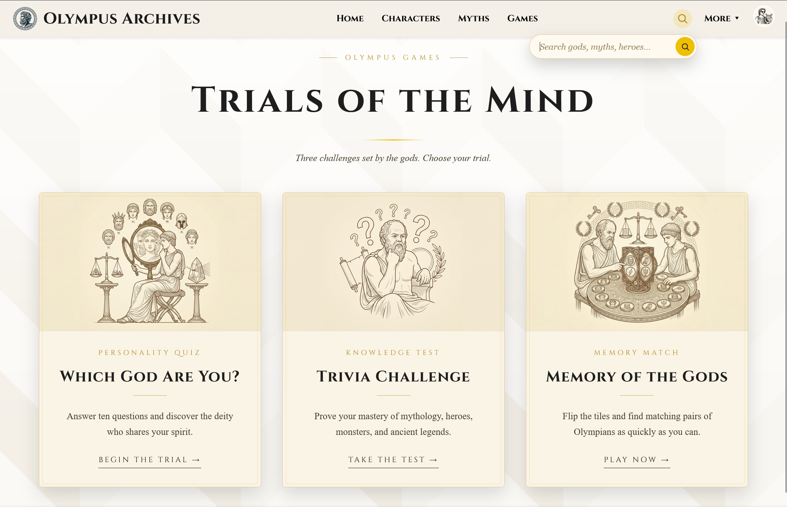
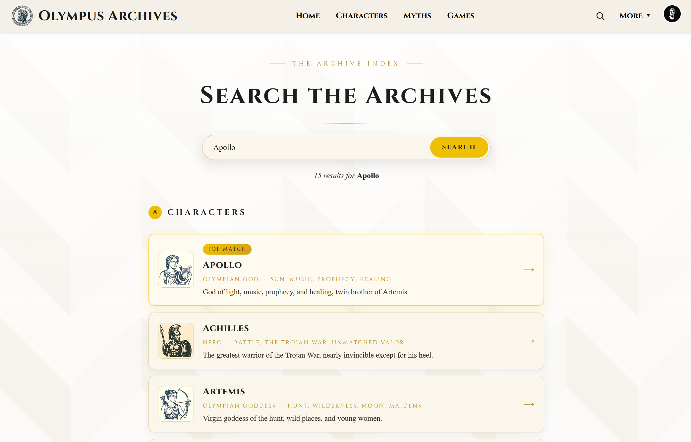
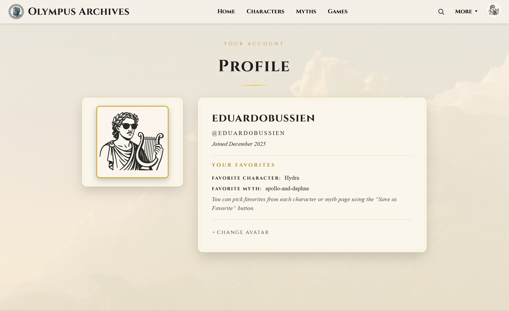
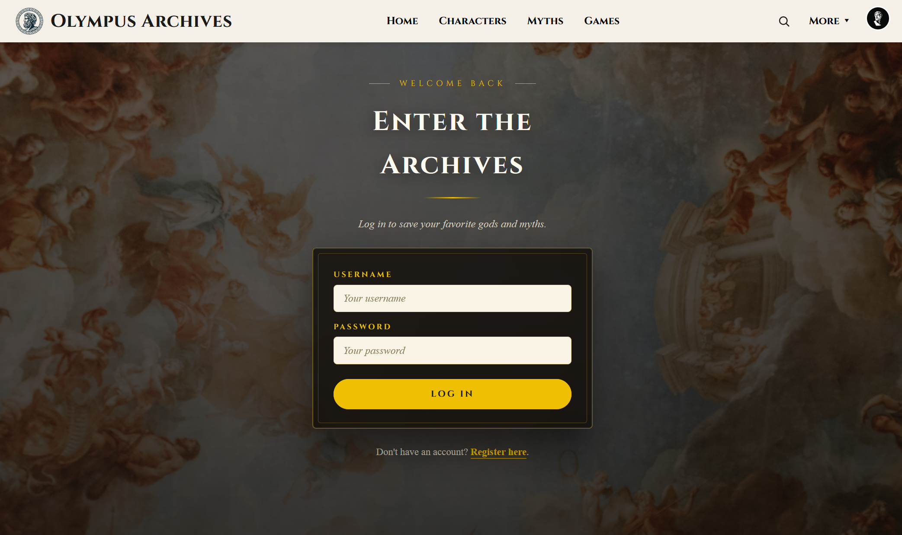

# Olympus Archives

A digital compendium of Greek mythology built with PHP and MySQL.
Olympus Archives gathers gods, titans, heroes, and monsters into illustrated profiles,
collects classic myths into a category-driven archive, and weaves it all together with
search, user accounts, and a small set of in-browser games.

> Built originally as a web-development class project and polished into a portfolio piece.

---

## Features

- **Character archive** &mdash; Olympian gods and goddesses, Titans, heroes, and monsters with full biographies and ancient source citations.
- **Myth archive** &mdash; creation stories, famous quests, and tragedies with full narratives and main-character lists.
- **Smart search** &mdash; ranks results by relevance: exact name, prefix, contains, then matches in domain, type, or full biography.
- **User accounts** &mdash; secure registration with `password_hash` (bcrypt), session-based login, profile page with avatar selection.
- **Favorites** &mdash; logged-in users can mark favorite characters and myths from their profile.
- **Random featured myth** on the homepage, refreshed on every visit.
- **Three browser games**
  - *Which God Are You?* &mdash; a 10-question personality quiz.
  - *Trivia Challenge* &mdash; multiple-choice mythology trivia.
  - *Memory of the Gods* &mdash; a card-matching game seeded from the live character database.
- **Responsive design** with a mobile hamburger nav at 850px.
- **Custom 404 page** wired through `.htaccess`.

---

## Tech Stack

- **PHP** (server-side rendering, sessions, prepared statements via MySQLi)
- **MySQL / MariaDB** (XAMPP)
- **HTML5 + CSS3** (Cinzel + GFS Neohellenic typography, parchment palette)
- **Vanilla JavaScript** (no frameworks &mdash; slideshow, scroll animations, game logic)

No build step, no package manager &mdash; just drop into XAMPP and run.

---

## Screenshots

### Home Page


### Characters Page


### Single Character Profile


### Myths


### Single Myth


### Games Hub


### Search


### User Profile


### Login


---

## Setup

### Prerequisites

- [XAMPP](https://www.apachefriends.org/) (Apache + MariaDB) or any PHP 7.4+ / MySQL stack.
- This project assumes MariaDB is reachable on **port 3307** by default. See *Configuration* below to change that.

### Install

1. **Drop the project into your web root.**
   ```
   xampp/htdocs/olympus
   ```
2. **Create the database.** In phpMyAdmin (`http://localhost/phpmyadmin`) create a new database named `olympus_db` with the `utf8mb4_general_ci` collation.
3. **Run the installer.** Open
   ```
   http://localhost/olympus/sql/install.php
   ```
   The installer creates every table, seeds all characters and myths, applies the expanded biographies and source citations, and normalizes punctuation. Re-running is safe.
4. **Open the site** at `http://localhost/olympus/`.

### Configuration

`sql/db.php` reads database credentials from environment variables, with sensible XAMPP defaults so the project runs out of the box:

| Variable             | Default      |
| -------------------- | ------------ |
| `OLYMPUS_DB_HOST`    | `127.0.0.1`  |
| `OLYMPUS_DB_PORT`    | `3307`       |
| `OLYMPUS_DB_USER`    | `root`       |
| `OLYMPUS_DB_PASS`    | *(empty)*    |
| `OLYMPUS_DB_NAME`    | `olympus_db` |

To override locally without touching tracked files, copy `sql/config.example.php` to `sql/config.local.php` and edit the values. `config.local.php` is gitignored.

---

## Project Structure

```
olympus/
├── index.php                  # Homepage (entry point)
├── .htaccess                  # 404 routing, directory listing off
├── css/                       # Per-page stylesheets + global styles.css
├── js/                        # scripts.js (global) + per-game files
├── img/                       # Portraits, myth illustrations, avatars, slideshow
├── html/                      # All sub-pages (characters.php, myth.php, login.php, etc.)
│   ├── nav.php                # Shared navigation
│   └── footer.php             # Shared footer
└── sql/
    ├── db.php                 # MySQLi connection (env-driven)
    ├── install.php            # One-click installer (schema + seeds + upgrades)
    ├── config.example.php     # Copy to config.local.php for private credentials
    ├── seed_characters.php    # Base character data
    ├── seed_myths.php         # Base myth data
    ├── add_more_characters.php
    ├── add_more_myths.php
    ├── upgrade_bios.php       # Expanded character biographies + sources
    ├── upgrade_myths.php      # Expanded myth narratives + sources
    └── fix_dashes.php         # Punctuation normalization
```

---

## A Note on the Contact Form

The contact form on `html/contact.php` is part of the showcase. It validates input
and acknowledges submission on screen, but no message is sent or stored anywhere.
The page itself displays a small note explaining this so visitors aren't misled.

---

## License

Released under the [MIT License](LICENSE).

---

## Author

**Eduardo Bussien** &mdash; [@eduardobussien](https://github.com/eduardobussien)
